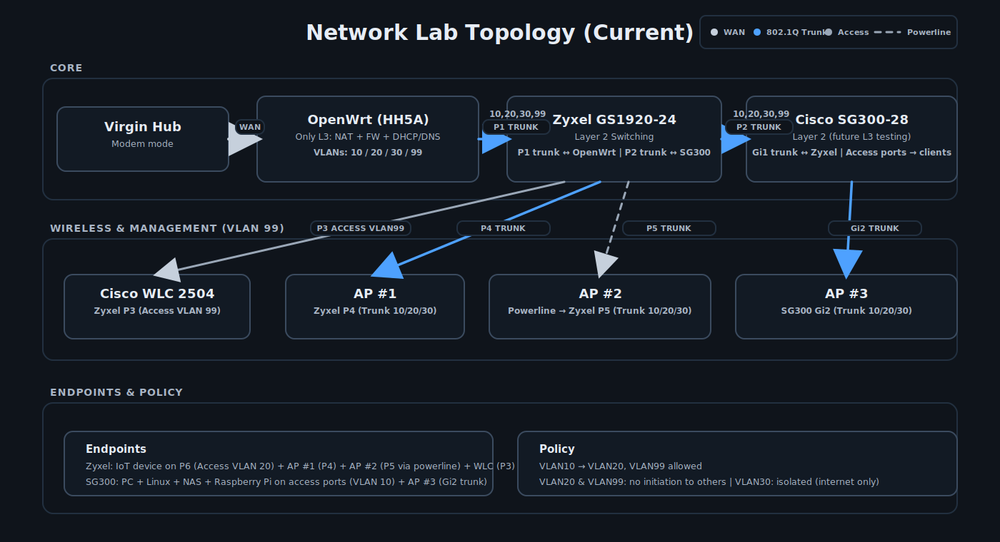

# 🏗 Network Segmentation & Enterprise Troubleshooting Lab

> A policy-driven, multi-VLAN home lab built on physical hardware to model real-world segmentation, trust boundaries, and centralised routing authority.

**Updated:** Mar 2026  
**Category:** Network Engineering Lab  
**Focus:** VLAN Segmentation • Firewall Policy Design • Wireless Integration • Controlled Trust Boundaries  

---

## 🎯 Design Objective

This lab is intentionally engineered to:

- Centralise Layer 3 routing authority
- Enforce asymmetric trust boundaries
- Maintain strict Layer 2 / Layer 3 separation
- Mirror segmentation across wired and wireless clients
- Surface realistic failure modes for structured troubleshooting
- Progressively move toward least-privilege management access

Connectivity alone is not the goal.  
**Controlled connectivity is.**

---

## ♻️ Lab Ethos

This is a living home lab.

Hardware may change.  
Topology may evolve.  
Policies may tighten or relax as learning objectives shift.

The aim is not production-grade uptime, but deliberate experimentation within a usable home network environment.

Ongoing evolution is documented in `lab-notes/`.

---

## 🧩 Core Components

- **OpenWrt (BT Home Hub 5A)** – Single Layer 3 authority (Routing, NAT, Firewall, DHCP, DNS)
- **Zyxel GS1920-24** – Layer 2 switching (SMB GUI-managed)
- **Cisco SG300-28** – Layer 2 switching (Enterprise-style CLI)
- **Cisco WLC 2504** – Centralised wireless control (VLAN 99)
- **Cisco 2602i / 3802i APs** – Trunked AP deployment
- **802.1Q Trunking** – End-to-end VLAN tagging
- **Virgin Hub (Modem Mode)** – ISP handoff (no routing functions)

Older hardware is intentionally retained where viable to maximise learning value rather than replacing equipment prematurely.

---

## 🗺 Architecture Diagram

Routing authority is centralised on OpenWrt.  
Switches perform no inter-VLAN routing.

---

## 🔐 VLAN & Policy Model

| VLAN | Name        | Purpose        | Behaviour |
|------|------------|---------------|-----------|
| 10   | Trusted     | Primary LAN    | Can reach VLAN 20 & VLAN 99 (administrative access) |
| 20   | IoT         | Restricted LAN | Cannot initiate to VLAN 10 or VLAN 99 |
| 30   | Guest       | Internet-only  | No internal access |
| 99   | Management  | Infrastructure | Administrative plane (hardening in progress) |

### Policy Enforcement

- VLAN 10 → VLAN 20: Allowed  
- VLAN 20 → VLAN 10: Blocked  
- VLAN 30 → Internal VLANs: Blocked  
- VLAN 20 → VLAN 99: Blocked  
- VLAN 30 → VLAN 99: Blocked  
- All VLANs → WAN: NAT via OpenWrt  

All security enforcement occurs at Layer 3.  
Switches remain strictly Layer 2 by design.

---

## 🔄 Layer 2 Architecture

Both switches operate purely at Layer 2:

- 802.1Q trunking between devices  
- Access ports assigned per VLAN  
- No inter-VLAN routing enabled  
- Clear separation of switching vs routing responsibility  
- Comparative exposure to SMB GUI and enterprise-style CLI platforms  

---

## 🛡 Layer 3 Authority (OpenWrt)

OpenWrt functions as the single routing boundary.

Responsibilities:

- Inter-VLAN routing  
- Firewall rule directionality  
- NAT (masquerading)  
- DHCP / DNS services  

Design principle:

> Switching ≠ Routing

---

## 📡 Wireless Integration

- WLC 2504 placed in VLAN 99 (Management)  
- APs trunked from both switches  
- SSIDs mapped directly to VLANs 10 / 20 / 30  
- Wireless segmentation mirrors wired policy  
- No policy exemptions for wireless clients  

---

## 🔒 Management Plane Control (Planned Hardening)

VLAN 99 is designated as the infrastructure management network.

**Current state**

- Reachable from VLAN 10 for administrative access  
- Not reachable from VLAN 20 (IoT) or VLAN 30 (Guest)  

**Planned evolution**

- Restrict VLAN 99 access to specific management hosts only  
- Replace broad VLAN 10 → VLAN 99 access with host-level firewall constraints  
- Progressively enforce least-privilege management design  

Management access should be deliberate and minimal — broad reachability is transitional, not the end state.

---

## 🧪 Documented Failure Scenarios

### LAN Has No Internet, Router Does

**Root cause:** Misconfigured forwarding or masquerade rule.  
**Lesson:** Validate NAT and zone forwarding, not just WAN link status.

---

### VLAN Tagging Errors

Incorrect trunk tagging or PVID assignment can produce partial connectivity or segmentation leaks.

Validation includes:

- Port membership inspection  
- Cross-VLAN testing  
- DNS / HTTP traffic validation  
- Not ICMP alone  

---

## 🧠 Troubleshooting Framework

1. Physical link verification  
2. VLAN tagging validation  
3. IP / Gateway confirmation  
4. Firewall rule directionality  
5. NAT / masquerade behaviour  
6. Real application traffic validation  

Structured fault isolation prevents chasing symptoms instead of root causes.

---

## ⚖ Design Tradeoffs

- Centralised routing simplifies policy enforcement  
- Switches remain Layer 2 for architectural clarity  
- Dual-switch design retained for platform familiarity  
- Wireless fully integrated without bypassing segmentation  
- Management-plane access currently pragmatic; tightened over time  

---

## 🚀 Status

Active and evolving.

Future expansion may include:

- Further management-plane hardening  
- Wireless optimisation testing  
- Expanded firewall policy complexity  
- Monitoring and logging integration  
- Comparative routing models  

Segmentation is enforced, tested, and validated using real client traffic.
